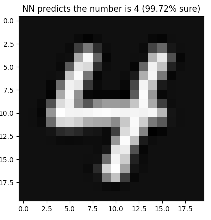

# NN with Numpy, Keras or Pytorch

This repository contains code to train and use a neural network that predicts the value of numbers from handwritten images. I wrote 3 ways to train the neural network:

- [Numpy](https://numpy.org): Package to implement a range variety of mathematical functions. As it does not have modules to make neural networks, this method consists of programming all the algorithms from scratch.

- [Keras](https://keras.io): Specialized API for methods used in AI.

- [Pytorch](https://pytorch.org): Specialized framework for methods used in AI.

Since the purpose of this repository is to serve as a reference to learn how classification neural networks work from different approaches, all codes commited here are commented as much as possible.Therefore, the codes are not generalized for every problem and may not be fully optimized. Again, the purpose of the repository is purely educational.

## Instructions

Clone this repository in your computer and run the `main.py` code. Then, just follow the instructions and type a number to run a certain code:
- `1` to run the `numpy_approach.py` code
- `2` to run the `keras_approach.py` code
- `3` to run the `pytorch_approach.py` code
- `q` to quit and exit

The code then will train a Neural Network and test it right away. For all approaches, the code shows the actual image of the number and the prediction
of the Neural Network, like the image below.

